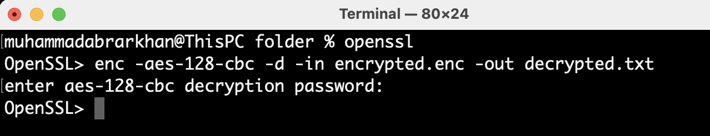

# OpenSSL Encryption/Decryption
 
<br>
by CyberAybie


## Description

A simple guide on how you can encrypt/decrypt a file using openssl library.

## Getting Started

### What you need?

* openssl installed
* a sample plaintext file

### Installing

* Just install openssl via terminal or cmd

### Executing program

#### Step 1: 

* Check all available commands 

```
openssl
list -commands
```

#### Step 2:
 * make a folder and have your plain file in it
 
 
 
 

 #### Step 3:
 * Encrypt using the following command
 ```
enc -aes-128-cbc -salt -in msg.txt -out encrypted.enc
```
after this you will choose the keyphrase! remember this as you will need it during decryption too.

 
 
 
 
 
 
  #### Step 4:
  * Decrypt using the following command
 ```
enc -aes-128-cbc -d -in encrypted.enc -out decrypted.txt
```
enter the keyphrase!




  
## Author
 
Abrar (CyberAybie is my tag) [See my Linkedin](https://www.linkedin.com/in/cyberaybie/)

## Version History

* 0.1
    * Initial Release

## License

This project is free to use
